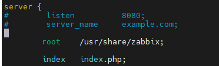

<h2>Script com instalação padrão do Zabbix, MySQL, NGINX e o Grafana </h2>

<p>Download da ISO do Ubuntu Server</p>
<p>https://releases.ubuntu.com/22.04.3/ubuntu-22.04.3-live-server-amd64.iso</p>

<p>Desenvolvido e personalizado por Joel Fernandes</p>
<h2>Meus contatos :</h2>
<p>- Celular:  (61) 98468-1921</p>
<p>- Linkedin: https://www.linkedin.com/in/joel-fernandes-25838425/</p>
<p>- Facebook: https://www.facebook.com/JoelFernandesSilvaFilho/</p>
--------------------------------------------------------------------------
<h3>Esse script foi desenvolvido para trabalhos de testes nas versões 6.0, 6.4 e 7.0</h3>
Ele deve ser usado apenas para ambiente de testes e laboratórios, pois está apenas reproduzindo os comandos que estão no site da Zabbix no link "Download" , https://www.zabbix.com/download .

## Etapa 1: Faça o clone do repositório em seu Ubuntu 24.04 LTS

````
sudo git  clone https://github.com/JoelFernandes01/Zabbix-via-Scripts.git
````


## Etapa 2: Entre na pasta e torne o script executável


## Etapa 3: Execute o script e escolha a versão que deseja instalar


## Etapa 4: Aguarde a instalação terminar


## Na etapa da criação das tabelas, é normal demorar um pouco, não cancele, só espere


<h4>Observação:</h4>
<p>Ao final do script, você irá precisar colocar o IP e descomentar as linhas no arquivo "/etc/zabbix/nginx.conf"</p>



Se achar que possa nos ajudar em melhorá-lo, entre em contato e vamos melhorar .

Agradeço a quem puder colaborar .

--------------------------------------------------------------------------
<h3>Esse script foi desenvolvido para trabalhos de testes nas versões 6.0, 6.4 e 7.0</h3>
Ele deve ser usado apenas para ambiente de testes e laboratórios, pois está apenas reproduzindo os comandos que estão no site da Zabbix no link "Download" , https://www.zabbix.com/download .